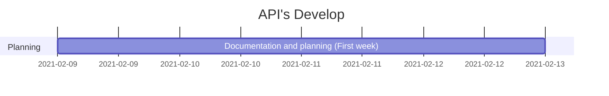

GRITREADERS
FRONTEND
 

===

## Table of Contents

[TOC]

## General Description

At present there is a large number of readers who are looking for reference sources and / or reviews that facilitate the process of choosing their next book, in the same way they seek to have a tool that allows them to share their experiences as well, progress, progress, and of course a personal opinion regarding the material or book read. 

## Folder Structure

Project Backend/Data Science Timeline
---

> Read more about the project here: https://www.notion.so/Gritreaders-58d68e32afff4d33888a7c545db78af4

## Technologies

* 
* 

### Libraries

## Routes

##  Architecture

